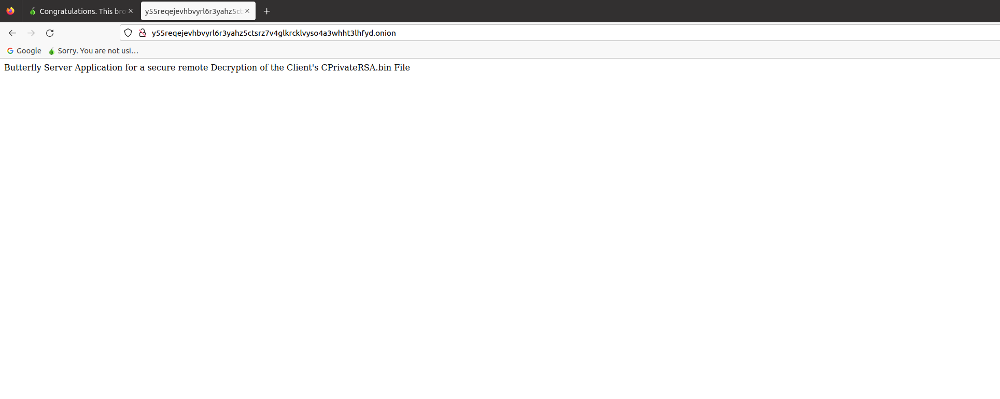
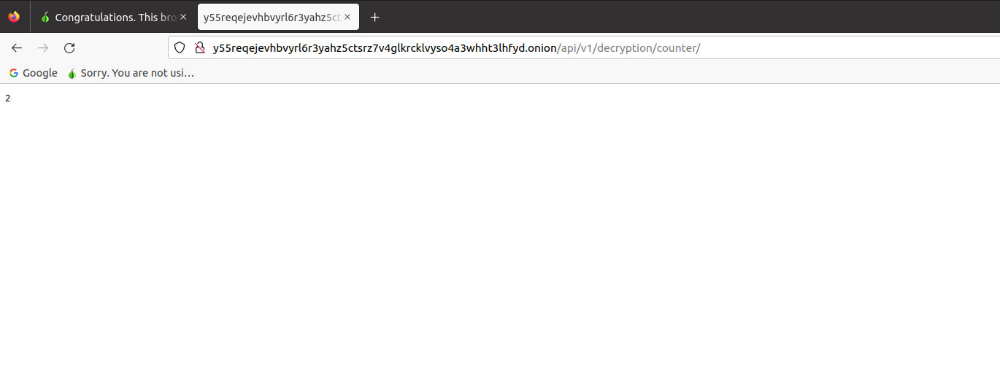

# Tor Hidden Service
Settings to create a hidden service for a secure remote decryption over the tor network

## Torrc Settings

Install tor with
<pre><code>
sudo apt-get install tor
</code></pre>

Edit `torrc` file in `/etc/tor`. Adapt the ip and port where the bflyServerApp is running
<pre><code>
HiddenServiceDir /var/lib/tor/hidden_service/
HiddenServicePort 80 127.0.0.1:5000
</code></pre>

Restart the tor service
<pre><code>
sudo systemctl restart tor
</code></pre>

Open the `hostname` file in `/var/lib/tor/hidden_service/`
<pre><code>
y55reqejevhbvyrl6r3yahz5ctsrz7v4glkrcklvyso4a3whht3lhfyd.onion
</code></pre>

Check tor settings
<pre><code>
https://check.torproject.org/
</code></pre>

## Deploy bflyServerApp

Install bflyServerApp with pip
<pre><code>
pip3 install bflyServerApp-*-py3-none-any.whl
</code></pre>

Create a systemd service file
<pre><code>
[Unit]
Description=Butterfly Server Web App
Requires=network-online.target
After=network-online.target

[Service]
Type=simple
ExecStart=/usr/local/bin/bflyServerApp --host 127.0.0.1 --port 5000 --key /home/christian/butterfly/masterkeys/SPrivateRSA.pem
Restart=always
User=christian
Group=christian
UMask=002

[Install]
WantedBy=multi-user.target
</code></pre>

Start `bflyServerApp.service` file
<pre><code>
sudo systemctl start bflyServerApp.service
</code></pre>

## Apache Settings (If needed)

## Test your onion service with firefox

### Settings -> Network Settings

### Open your browser and insert the hostname

### Test the api

